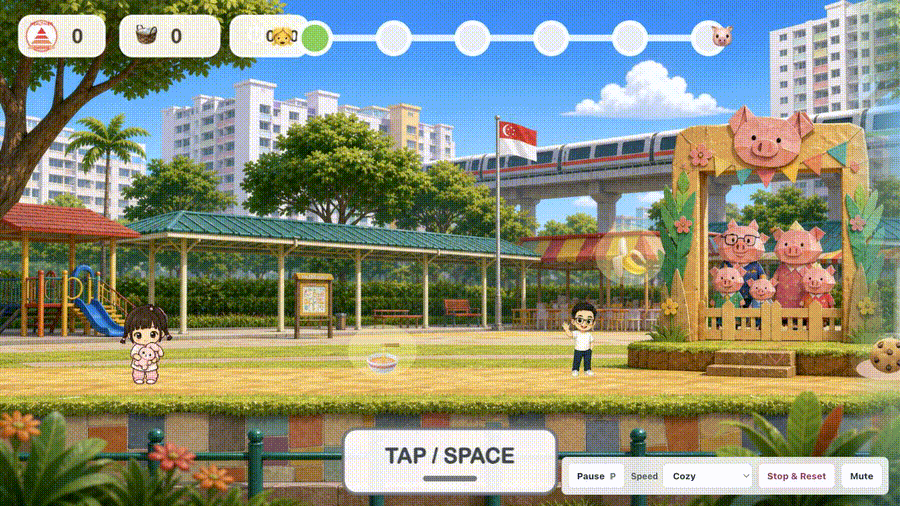
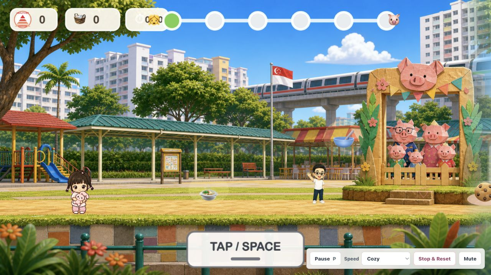
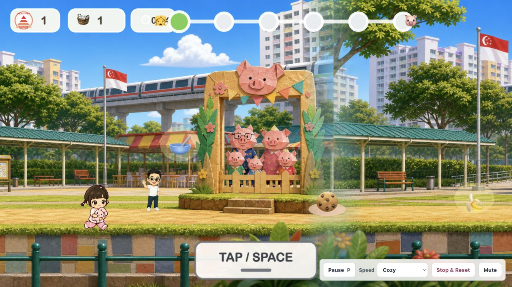
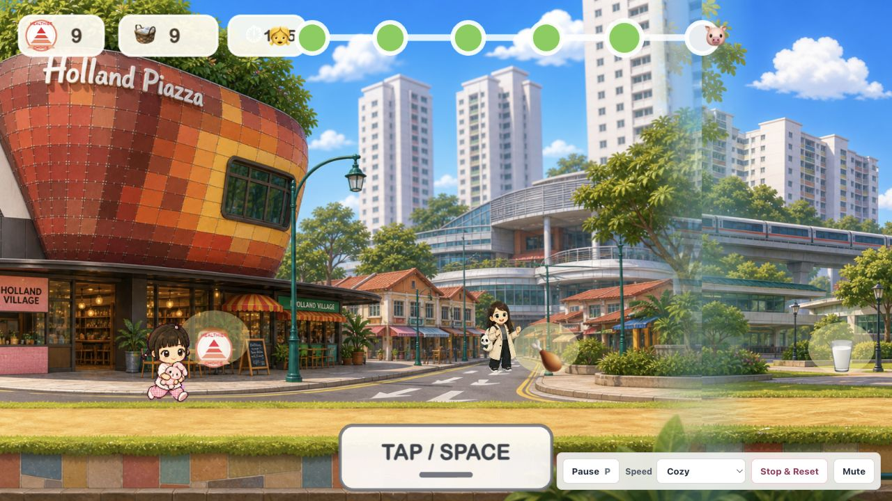

# Health Food Choice Game



**A Singapore-inspired preschool runner built through vibe-coding for my daughter Rae.**

**Play it here:** [health-food-choice-game.vercel.app](https://health-food-choice-game.vercel.app)

This started as a dad idea: could I turn Rae's favorite people, places, and foods into a simple game that teaches without feeling like homework? The result is a one-button adventure where Rae runs through familiar Singapore scenes, collects everyday foods, learns "small bites" for treats, and gets cheered on by family NPCs.

The goal is not to build a perfect commercial game. The goal is to show how fast an idea can become a playable learning tool when a parent, a child, and an AI coding partner iterate together.

## What It Is

Health Food Choice Game is a side-scrolling runner for toddlers and preschoolers:

- One action: tap or press `Space`.
- Landscape-first mobile/tablet/iPad play.
- Singapore scenery including HDB playgrounds, Sheng Siong, Koufu, Marina Bay, Singapore Zoo, Sparkletots, NUH, Holland Village, Buona Vista, and Botanic Gardens.
- Everyday food collection with Healthier Choice style rewards.
- Treat foods framed gently as "small bites", not punishment.
- Family NPCs that appear throughout the route as animated supporters.
- Short recap loop to reinforce what was collected.

## Why I Built It

I wanted a game that Rae could understand instantly:

- No menus to learn.
- No reading required.
- No harsh losing state.
- No shaming food.
- Familiar places from her world.
- A learning objective hidden inside real play.

This is the part I love about vibe-coding: instead of starting with a formal spec, I started with a parenting instinct. We shaped the game through screenshots, reactions, corrections, and lots of "this feels right" / "this feels wrong" iteration.

## Screenshots







## Gameplay Principles

- **One-button play:** Rae only needs tap or `Space`.
- **Soft learning:** everyday foods are rewarded; treats are explained as "small bites".
- **Comfortable pacing:** the route is intentionally slower and more forgiving than a typical arcade runner.
- **Recognizable world:** scenes are designed around places Rae knows in Singapore.
- **Expandable levels:** Level 1 is food; future levels can teach numbers, words, colors, shapes, transport, and animals.

## Mobile And Tablet

The game is optimized first for **landscape phone, tablet, and iPad**:

- Tap anywhere on the game canvas to start, jump, skip recap, or replay.
- `Space` still works for keyboard play.
- Parent controls stay in a compact bottom-right panel.
- Portrait mode shows a landscape hint instead of pretending portrait is ideal.

## Tech Stack

- React
- Phaser
- Vite
- TypeScript
- Web Audio API
- Browser speech synthesis

## Run Locally

```bash
npm install
npm run dev
```

Then open:

```text
http://127.0.0.1:5175/
```

For a production build:

```bash
npm run build
```

## Project Shape

```text
src/
  App.tsx                         React shell and parent controls
  data/healthyFoodLevel.ts        Level 1 scenery and food definitions
  game/
    RunnerScene.ts                Phaser runner engine
    AudioGuide.ts                 Music, sound effects, and speech prompts
public/assets/                    Game art and character assets
docs/media/                       README screenshots and gameplay GIF
```

## Future Levels

The engine is intentionally data-driven so new learning objectives can reuse the same runner:

- Level 2: numbers
- Level 3: words or early reading
- Level 4: colors, shapes, animals, or transport
- Bonus mode: family scavenger hunt

## Asset And Privacy Notice

This repository is public so others can learn from the code and the build process.

The **source code** is MIT licensed. The **visual/audio/media assets are not**. Character likenesses, family NPC art, screenshots, gameplay GIFs, and generated game artwork are personal project assets and are reserved by the project owner. Please use the code patterns, not the private character assets.

See [ASSET-NOTICE.md](ASSET-NOTICE.md) and [LICENSE](LICENSE).

## Built With Vibe-Coding

This project was built by iterating directly on a playable prototype: critique the screenshot, adjust the game, test again, repeat. It is a small example of what I think parent-led AI creation can become: not generic educational software, but tiny custom worlds made for one child first.
